# Solution Architecture Tutorial Screenshots

## GitHub ARC controller and runners using  Azure Files and Azure Container Storage Architecture
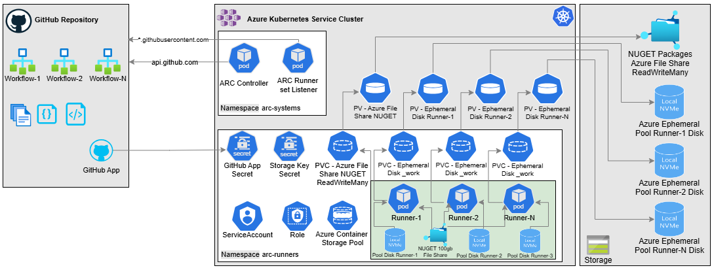

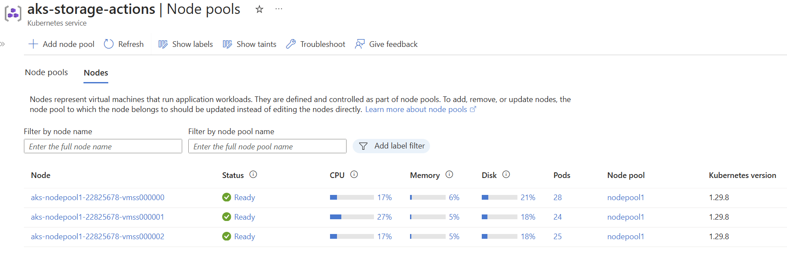

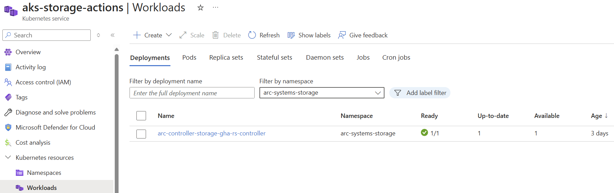

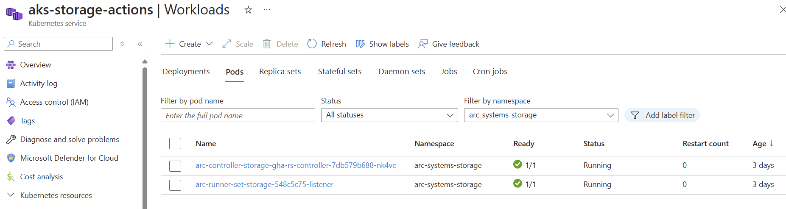

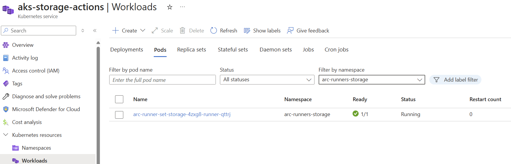

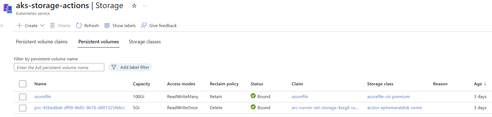

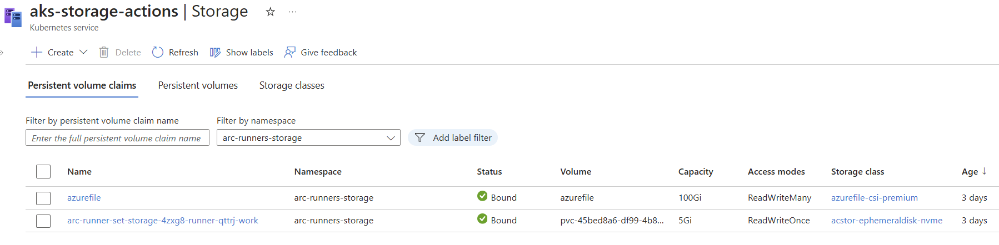

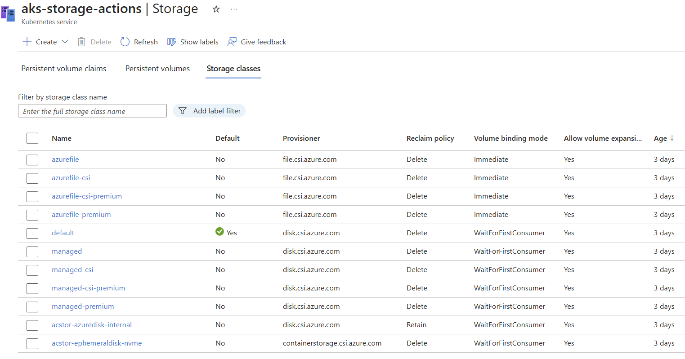

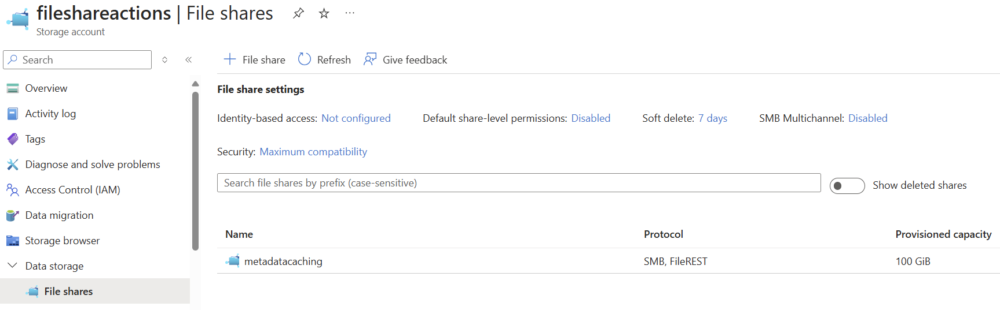

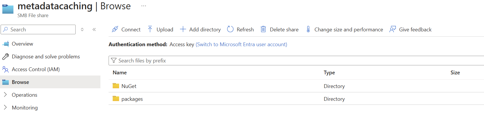

## GitHub ARC controller and runners using Azure Files Architecture
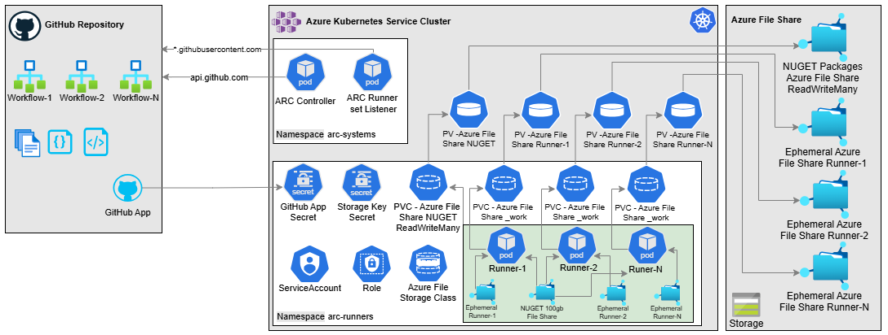
